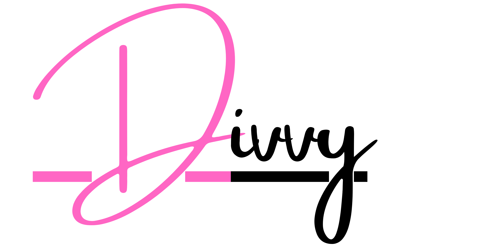

<h1 align="center">  </h1>

<h3 align="center">Divvy is a Decentralised Dapp made on Web3. It's a Marketplace for artists to sell their digital assets, earn royality and make some sales on the polygon matic network.</h3>

<p align="center">Made with ♥️ using  and  by <a href="https://piyushmehta.com"><strong>Piyush Mehta</strong></a></p>


### Wallets Compatible
• [MetaMask](https://metamask.io)

### Crypto Currency for exchange of NFTs
• [Polygon Matic](http://polygon.technology)

## How to run this project locally

### Prerequisites

1. Git
1. Node: any 12.x version starting with v12.0.0 or greater
1. Yarn: See Yarn website for installation instructions
1. A fork of the repo (for any contributions)

### 1. Setting up local env

1. Create `secret.js` in the root of the project 

```js
// secret.js get private key and project id from https://infura.io

const PRIVATE_KEY = "your private key"
const PROJECT_ID = "your project id"
module.exports = { PRIVATE_KEY, PROJECT_ID };

```

2. Installing dependencies

```bash
 ➜ yarn install
```

3. Install [Metamask](https://metamask.io) on your choice of browser

### 2. Running the blockchain locally

```bash
  ➜ npx hardhat test # To test the smart contract
  ➜ npx hardhat run scripts/deploy.js --network localhost # To get cred for local network
  ➜ npx hardhat node # create a local node
```

### 3. Running the frontend locally

```bash
  ➜ yarn dev
```


_____________________

<p align="center">Made with ❤️ by <a href="https://piyushmehta.com">Piyush Mehta</a></p>
